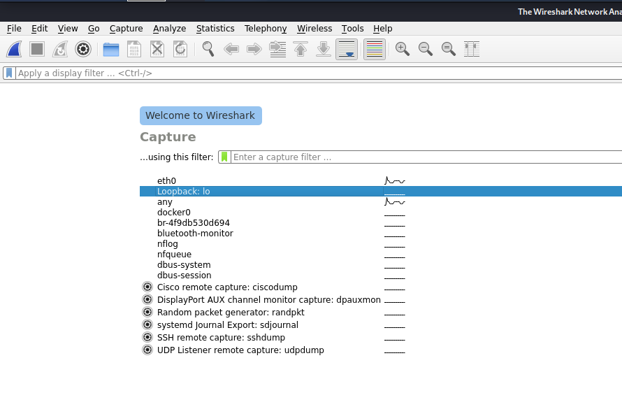
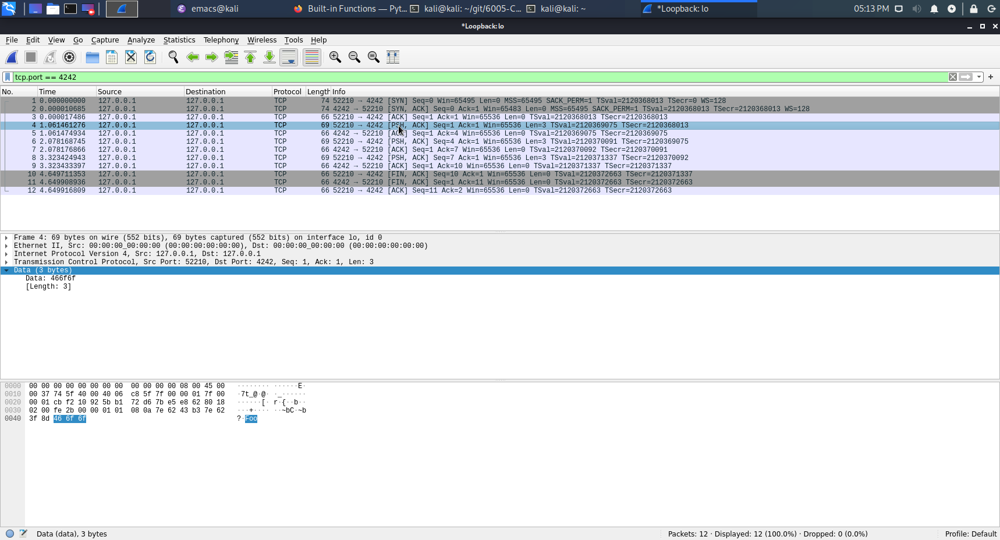

# Encrypted Chat Client Task

## Overview

In this practical task we are going to write an encrypted chat program.

We will start with a basic chat app, and examine the network traffic.

We will then start adding "Layers" of encryption, each time seeing
what difference this makes to the network traffic, and how easy it is
to intercept and read the Messages.

## The *Buggs* Chat Client.

In the **Buggs** directory you can find starting code for our simple Whatsapp clone.

 - The **main.py** file, is the Entry Point.  I don't really expect you to modify this.
   HOWEVER,  you can change the logging level to remove debugging messages
 - The **network** file contains the base networking code.  You can Ignore this.
 - The two **<whatever>Driver.py** file is what you need to edit.

### Driver Code

You are expected to modify the Driver code to create an Encrypted messenger.


## Task 1:  Testing the Client

First Lets check the Code Works,  We will send messages to ourselves.

  - Start the program by running **main.py**
  - Enter Messages and watch them get echoed on the screen
  - use **-1** to exit


```python
$ python3 main.py 
WARNING:root:YOU ARE NOT EXPECTED TO IMPORT THIS CODE
WARNING:root:Run as $python main.py
You need to specify an address to connect to
for example:
  - 127.0.0.1 (for your machine)
  - 10.0.2.15 (for someone elses machine)
>127.0.0.1
DEBUG:MAIN:Creating Server
DEBUG:CLIENT:Initialise Client
>DEBUG:SERVER:Connection from ('127.0.0.1', 52186)
Foo
>DEBUG:SERVER:Message Recived b'Foo'
Bar
>DEBUG:SERVER:Message Recived b'Bar'
Baz
>DEBUG:SERVER:Message Recived b'Baz'
-1
DEBUG:SERVER:Message Recived b''
EOF
```

### Viewing The Data in Wireshark

We can use Wireshark to see the data that is being transmitted.
[Basic Wireshark Tutorial](https://www.varonis.com/blog/how-to-use-wireshark/)

In Kali you can start by clicking the Kali icon and typing wireshark

As we are sending the Data Locally, lets set the interface to be Loopback (as it will reduce the amount of data we see)



!!! note

    If you have already used wireshark,  you can set the current interface using **capture** -> **options**

Once you select the interface Wireshark will start capturing Packets.  (You may have to click the Fin Icon in the top Left)
Start the Chat program again,  and send a few messages.  Once you are done exit the chat **-1** and click the red *stop-capture* icon in wireshark


### Examining Packet Information.

In the packet data window we can see the full history of the connection

We are interested in packets

  - From our local connection
  - TO port 4242 (where the server is listening)

In the image below I have highlighted one packet where we are sending data.


You can see at the bottom of the screen we have the raw packet information.
And the data itself.

Obviously an attacker could also use this (if they had access to the network)
to view the chat messages we send.

!!! question

    There are a load more packets that the messages we sent.
    Can you identify what:

       - The First 3 packets are?
       - The Last 3 Packets are?
       

## Task 2:  Talking to a Friend / Another Machine

We can also use the chat client to talk to another Machine

!!! important

    You need to put your Kali Box in Bridged mode for this
    Otherwise we cannot access the main network

For this we need a Pair of IP addresses.  Yours and the Target
On each machine you need to:

  - Start the chat server with the IP address of "THE OTHER MACHINE"

### Capturing this traffic

This time, (as we are not talking locally)we need to change the IP address that wireshark uses to capture to **eth0**

Capture the traffic again and see if you can identify the messages.

!!! note

    When working with something that is not the loopback
    we might get a lot of traffic.

    We can filter this using the filter ```tcp.port == 4242```


## Part 2:  Changing the Behaviour of the Client

Before we get adding encryption lets look at changing the behaviour of the chat
The two *driver* files contain the logic for sending and receiving data.


### Changing the Send Logic.

To change what the Client sends we can need to modify the *sendMessage* function in *clientDriver*


```python
def sendMessage(self, message):
    """Helper Function to send a message
    This is what we need to modify to send a message
    """        
    self.sock.sendall(message.encode())
```

Lets change the Code to Prefix Everything with "MESSAGE"

!!! note "Keeping the Code Sane"

    We could do this in-place, but to keep the code sane we are going to create a
    a new function to modify the data.

    This means we can just change the function,  Rather than have to fix the
    send message code each time we make a modification


```python
def modifyData(self, message):
    procMessage = "MESSAGE: {0}".format(message)
    return procMessage

def sendMessage(self, message):
    """Helper Function to send a message
    This is what we need to modify to send a message
    """

    procMesage = modifyData(message)
    self.sock.sendall(procMessage.encode())
```


!!! task "Change the Send Code"

    Lets pretend we are sending a password
    Change the modifyData function to hash the input and send it

### Changing the Server Functionality

We can also modify the **procesData()** function in **serverDriver**, to change the behaviour
when we receive data.

For example.  We could print an all uppercase version of the Input using the code below

```
    def processData(self, data):
        """
        And process the data 

        Add our Logic Here
        """
        self.log.debug("Message {0}".format(data))
	self.log.debug("Uppercase {0}".format(data.upper())
```


!!! task "Change the Receive Code"

    Lets continue the password task.
    
    Change the receive code to take the hash that you have sent
    in the task above.  And check it against a known hash (IE the correct password)
    Print a message if the login is successful


### Getting the Server to return Data.

!!! note

    The output may  be a bit confusing when you are running locally, as you are sending
    a message back to yourself (thus everything is in one window)

    Remember you can also send to another machine


Finally lets get the server to send a message back to the client.  I am going to Echo back the message in uppercase
We need to do two things here.


#### 1.  Tell the client to expect data to come back

After our send call we can do another recv() to tell the client to expect data from the server

```
    def sendMessage(self, message):
        """Helper Function to send a message

        This is what we need to modify to send a message
        """

        self.sock.sendall(procMessage.encode())

        #And Expect a response
        data = self.sock.recv(1024)
        print("RESONSE FROM SERVER {0}".format(data))
```

#### 2. Tell the Server to send something

The server can use the  ```self.request.sendall()``` function to send data back.

```
    def processData(self, data):
        """
        And process the data 

        Add our Logic Here
        """
        self.log.debug("Message {0}".format(data))

        #Send something back
        self.request.sendall(data.upper())
```


You can see that the server will now send the data back in upper case

```
$ python main.py 
WARNING:root:YOU ARE NOT EXPECTED TO IMPORT THIS CODE
WARNING:root:Run as $python main.py
You need to specify an address to connect to
for example:
  - 127.0.0.1 (for your machine)
  - 10.0.2.15 (for someone elses machine)
>127.0.0.1
DEBUG:MAIN:Creating Server
DEBUG:CLIENT:Initialise Client
>DEBUG:SERVER:Connection from ('127.0.0.1', 52314)
Foo
DEBUG:SERVER:Message b'Foo'
RESONSE FROM SERVER b'FOO'
>Bar
DEBUG:SERVER:Message b'Bar'
RESONSE FROM SERVER b'BAR'
>

```

!!! task "Login Client"

    Modify the hash sending and checking code you developed earlier
    to simulate a login process.

    Get the server to send a message back to the client if login was
    successfully


!!! task "Use Wireshark to capture the communication"

    Use Wireshark to capture the communication again
    Identify where the Hash is being sent

!!! task "Can you login without knowing the password?"
 
    Imagine you have intercepted the message. But don't know
    the password.

    Could you complete the login process using the information
    from wireshark?

    (You can even do this without python, try using netcat)

   
## Basic AES Encryption

You can see that the message is still transmitted in plain text.
So we will add AES encryption to our program.

The **aesDemo.py** program has a simple example of encrypting and decryption data


Link to [Pycryptodome AES documentation](https://pycryptodome.readthedocs.io/en/latest/src/cipher/aes.html)

!!! note "Requirements"

    You need to install pycrypotome

    ```pip install pycryptodome```


!!! task

    Take a look through the AES Demo Code and see how it works

    Modify the code to allow the user to specify a message


!!! task

    Modify the Client Server Code to Encrypt and Decrypt messages
    using a Static Key and IV

!!! task

    Use Wireshark to intercept the messages.
    Identity where the code is being sent.

    Try to decrypt the intercepted message...

## AES with user specified passwords

Or last example has the problem that both the Key and IV are static
This time we will modify the code to allow the users to specify a key


WE can use the [PBKDF](https://pycryptodome.readthedocs.io/en/latest/src/protocol/kdf.html?highlight=PBKDF#Crypto.Protocol.KDF.PBKDF2)
functions to help us generate a key.

For example:

```python

from Crypto.Protocol.KDF import PBKDF2

salt = "SALT"
password = "userInput"

key = PBKDF2(password, salt)
print(key)
```

!!! task

    Modify the code to allow the user to specify a password.

      1.  Check that you can send and receive when both sides have the same password
      1.  What happens if the password differs on each side.

## Sending the Key Across the Network

Now lets look at sending the key across the network. (To simulate a HTTP style connect)

The Logic for our program looks something like this

  1. Client Connects to the Server 
  2. Server Generates a new random key and sends it to the client
  3. Key is used in all future comms


WE will need create a basic protocol for this.
I would suggest adding a prefix to control messages (which we can then look for and process)

for example ```KEY:<whatever>```  when sending a key.

!!! task  "Server Generated Keys"

    Modify the code so that the server generates the key (using the algorithm above)
    To keep things simple (at them moment use a static IV)

       1. Check that The Communication works as Expected
       2. Use Wireshark to intercept the Key exchange and message
       3. Can you decrypt messages that are sent?

    Bonus Task

       1. Generate a random IV and send it across
       1. Can you intercept the parts of the message in wireshark and Decrypt?


## (Optional) Key Exchange

You can see that if we can capture the key exchange we can still decrypt message.
Lets try to implement a DH style key exchange


!!! task "Diffie Hellman"

    Implement a basic version of Diffie Helman Key-exchange
    Does this stop our attacker being able to capture the packets

    [This Code is a good starting point](https://sublimerobots.com/2015/01/simple-diffie-hellman-example-python/)


    


   


